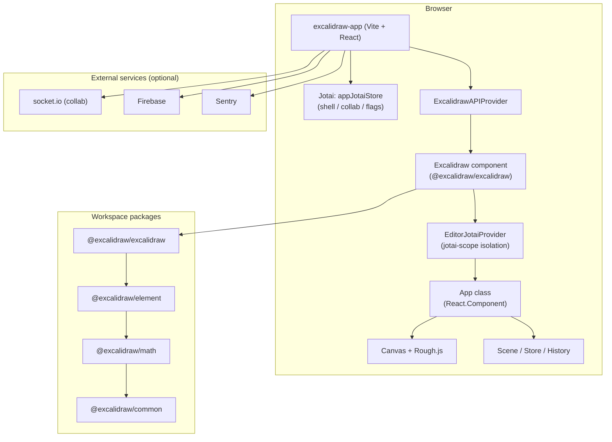

# Architecture (detailed)

This document expands on `docs/memory/systemPatterns.md` with structure, flows, deployment, and non-obvious behaviors inferred from the codebase. It is organized for readers who need a single map of layers, state, rendering, and dependencies before diving into source files.

## High-level Architecture

The product is a **Yarn workspaces monorepo**: a Vite-powered SPA (`excalidraw-app`) hosts the public Excalidraw experience, while the drawable editor and npm library live in `packages/excalidraw` and depend on smaller internal packages (`common`, `math`, `element`, `utils`). The shell wires collaboration (Socket.IO), optional Firebase, Sentry, and PWA behavior; the editor owns the canvas, tools, and scene model.

At runtime, the user interacts with React UI chrome and a single main **canvas** backed by imperative drawing (Rough.js on a `HTMLCanvasElement`). Serialization, import/export, and collaboration pass through the same element and scene abstractions defined in `@excalidraw/element` and used inside the editor `App` class.

### System diagram



### Repository topology

```text
excalidraw-monorepo/
├── excalidraw-app/          # Product SPA (Vite + React)
├── packages/
│   ├── common/              # Shared constants, utils, env helpers
│   ├── math/                # Geometry and math types
│   ├── element/             # Element model, mutations, Scene types
│   ├── utils/               # General helpers
│   └── excalidraw/          # Editor UI, public React API
├── examples/                # Embed integrations (Next.js, script tag)
├── firebase-project/        # Firebase-related config
├── scripts/                 # buildPackage, locales, release, etc.
└── .github/workflows/       # CI
```

## State Management

State is **split by layer** so the shell and the embeddable editor do not fight over a single store.

1. **Application shell (`excalidraw-app`)** — A root Jotai `Provider` uses `appJotaiStore` from `excalidraw-app/app-jotai.ts`. Atoms here cover product-level concerns: collaboration handles, quotas, feature flags, and other UI that wraps `<Excalidraw>` but is not part of the library’s internal editor model.

2. **Editor package (`packages/excalidraw`)** — `editor-jotai.ts` creates an isolated Jotai context via `jotai-scope` (`EditorJotaiProvider`, `editorJotaiStore`). That lets multiple conceptual “scopes” coexist and avoids leaking editor atoms to the rest of the tree. React hooks from this module are the package-local `useAtom`, `useAtomValue`, and `useSetAtom` bound to that isolation.

3. **Imperative editor core** — The main editor is the class `App` in `packages/excalidraw/components/App.tsx`. It keeps a large **`React.Component` state** object typed as `AppState` (defaults from `appState.ts`): active tool, zoom, scroll, selection, theme, export options, and transient UI flags. This state drives both React re-renders and canvas updates.

4. **Scene and history** — Alongside React state, `App` constructs a **`Scene`** (element graph), a **`Store`** for normalized element updates, and **`History`** for undo/redo. **`ActionManager`** registers actions and applies results synchronously, reading current `AppState` and `scene.getElementsIncludingDeleted()`.

5. **Persistence and hydration** — Libraries and some preferences use **`idb-keyval`** from the app; the shape library pipeline and URL token parsing (`parseLibraryTokensFromUrl`, `useHandleLibrary`) merge external data into the running editor through the public APIs.

Together, Jotai handles **cross-cutting shell and scoped editor atoms**, while **`AppState` + `Scene` + `Store` + `History`** own the authoritative drawing document.

## Rendering Pipeline

Rendering is **canvas-first**: the vector “look” is not a pile of SVG nodes for the whole scene but bitmap draws updated when the document or viewport changes.

1. **Canvas setup** — In `App`’s constructor, a `HTMLCanvasElement` is created programmatically. **`rough.canvas(this.canvas)`** attaches Rough.js for hand-drawn strokes. A **`Renderer`** instance is constructed with the same **`Scene`** reference.

2. **Renderable set** — `Renderer` (see `packages/excalidraw/scene/Renderer.ts`) computes which elements should be drawn: it considers viewport (`isElementInViewport` from `@excalidraw/element`), editing state (e.g. text being edited), and in-progress shapes. Results are memoized to avoid redundant work when inputs are unchanged.

3. **Static scene draw** — The actual paint path goes through **`renderStaticSceneThrottled`** (`renderer/staticScene`), which batches work so pan/zoom and frequent updates do not overload the main thread.

4. **React’s role** — React renders **toolbars, panels, dialogs, and layout** around the canvas. The heavy lifting for the whiteboard itself stays in imperative code coordinated with `requestAnimationFrame` in hot paths (e.g. deferred layout or focus fixes in `App.tsx` and related components).

5. **Embedded diagrams** — Features such as **Mermaid → Excalidraw** use separate rendering hooks (e.g. `useMermaidRenderer`) to produce elements that then flow through the same scene and canvas pipeline as user-drawn shapes.

6. **Build-time chunking** — The app’s Vite config splits large optional bundles (locales, Mermaid, CodeMirror/Lezer) so the initial canvas path stays lean; see “Frontend build details” below.

## Package Dependencies

### Workspace graph and build order

Internal packages follow a **directed dependency** chain. Published versions are aligned (e.g. `0.18.0` on `@excalidraw/common`, `@excalidraw/math`, `@excalidraw/element`, `@excalidraw/excalidraw`). The root script **`yarn build:packages`** runs **`common` → `math` → `element` → `excalidraw`** so downstream bundles always see built upstream artifacts.

- **`@excalidraw/common`** — Shared constants and utilities; depends on `tinycolor2`.
- **`@excalidraw/math`** — Depends on `@excalidraw/common`.
- **`@excalidraw/element`** — Element types, mutations, scene-related logic; depends on `common` and `math`.
- **`@excalidraw/excalidraw`** — The editor and public API; depends on all of the above plus Rough.js, Jotai, CodeMirror, Radix, Mermaid conversion, image/font helpers, etc. (see `packages/excalidraw/package.json`).

The **`excalidraw-app`** workspace depends on **`@excalidraw/excalidraw`** (via monorepo resolution), **React 19**, **Jotai**, **socket.io-client**, **Firebase**, **Sentry**, **idb-keyval**, and small utilities (`uqr`, `callsites`, i18next detector, `vite-plugin-html`).

### Consumption modes

| Mode | How `@excalidraw/*` resolves | Typical use |
|------|------------------------------|-------------|
| App dev | Vite `resolve.alias` → package **source** (`*.ts` / `*.tsx`) | Fast iteration in monorepo |
| Published npm | `package.json` **conditional exports** (`development` / `production`) → `dist/*` | External apps and examples after `build:packages` |
| Docker | `yarn build:app:docker` → static assets served by nginx | Production container |

Library bundles are produced by **`scripts/buildPackage.js`** (esbuild + Sass), not by the app’s Vite build. Base packages use **`scripts/buildBase.js`** or **`scripts/buildUtils.js`** as appropriate.

### Root toolchain (excerpt)

The repository root holds **TypeScript**, **Vite**, **Vitest** (+ coverage), **ESLint** (`@excalidraw/eslint-config`), **Prettier**, **jsdom**, and **canvas test mocks** — see root `package.json` for the full devDependency set and `yarn test:*` scripts.

## Runtime composition of the product app

1. **Bootstrap** — `excalidraw-app/index.tsx` mounts React, registers the PWA service worker, renders the shell.
2. **Error boundary** — `TopErrorBoundary` wraps the tree in `App.tsx`.
3. **Global state** — Jotai `Provider` with `appJotaiStore` for shell concerns (collab handles, quotas, flags).
4. **Imperative API bridge** — `ExcalidrawAPIProvider` (from `packages/excalidraw`) lets the shell call `useExcalidrawAPI()` outside the inner `<Excalidraw>` subtree.
5. **Editor** — `<Excalidraw>` hosts canvas, tools, dialogs; internal state uses the package’s Jotai layer (`editor-jotai`).

## Major data and integration flows

- **Scene** — Elements and app state are serialized/restored via package APIs (`restore`, `reconcile`, blob import/export).
- **Collaboration** — `excalidraw-app/collab/` plus `socket.io-client`; sharing UI in `share/`. Gated when running inside an iframe (see implicit behaviors below).
- **Library** — Shape libraries persisted with `idb-keyval`; URL parameters can seed or merge libraries (`parseLibraryTokensFromUrl` + `useHandleLibrary` in `App.tsx`).
- **Backend / cloud** — Optional Firebase, export-to-backend helpers under `excalidraw-app/data/`, Sentry in `excalidraw-app/sentry`.

## Frontend build details (Vite)

- **Output** — `excalidraw-app/build`.
- **Env** — `loadEnv` / `envDir` point at the **repository root** (`../` relative to the Vite config), so `.env` files next to root `package.json` apply to the app dev server and builds.
- **Chunking** — `manualChunks` separates locale JSON (except English and percentages), and heavy deps (e.g. Mermaid, CodeMirror/Lezer) for caching and load performance.
- **Fonts** — `.woff2` assets get stable paths under `fonts/<family>/`.

## Quality gates

- **Vitest** mirrors Vite aliases (`vitest.config.mts`), **jsdom** environment, `setupTests.ts` includes canvas mocking.
- **Coverage** — Thresholds and `ignoreEmptyLines: false` are intentional (see implicit behaviors).
- **Static checks** — `tsc`, ESLint (`@excalidraw/eslint-config`), Prettier at repo root.

## Implicit runtime and build behaviors (easy to miss)

These are not always visible in user-facing docs; they matter for embeds, CI, and local setup.

1. **Collaboration disabled in iframes** — `isRunningInIframe()` in `@excalidraw/common` uses `window.self === window.top`. If that check throws (e.g. cross-origin parent), the code treats the context as **iframe** and collaboration stays off (`excalidraw-app/App.tsx` → `isCollabDisabled`).
2. **App env files live at monorepo root** — Because `envDir` is `../`, developers who only look under `excalidraw-app/` may miss that **root** `.env*` files drive `VITE_*` variables (including `VITE_APP_PORT`).
3. **Locale split vs first-load/offline** — `manualChunks` excludes `en.json` and `percentages.json` from the “per-locale” chunks so they ship with the core bundle: first paint and PWA precache stay aligned with the previous CRA-style behavior (comment in `excalidraw-app/vite.config.mts`).
4. **Vitest hook ordering** — `sequence.hooks: "parallel"` is set explicitly because Vitest v2’s serial hook stack breaks monorepo test setup expectations (comment in `vitest.config.mts`).
5. **Coverage empty lines** — `coverage.ignoreEmptyLines: false` changes line counts versus Vitest defaults; thresholds were tuned for that (same config file).
6. **Library from URL** — On load, the shell calls `parseLibraryTokensFromUrl()` so query parameters can add library items without a separate import step (`excalidraw-app/App.tsx`).

## Sources in code

- `excalidraw-app/App.tsx`, `excalidraw-app/index.tsx`, `excalidraw-app/vite.config.mts`, `excalidraw-app/app-jotai.ts`
- `packages/excalidraw/index.tsx`, `packages/excalidraw/editor-jotai.ts`, `packages/excalidraw/components/App.tsx`, `packages/excalidraw/scene/Renderer.ts`, `packages/excalidraw/data/library.ts`
- `packages/common/src/utils.ts` — `getFrame`, `isRunningInIframe`
- `scripts/buildPackage.js`, root and package `package.json`
- `vitest.config.mts`, `Dockerfile`, `docker-compose.yml`
